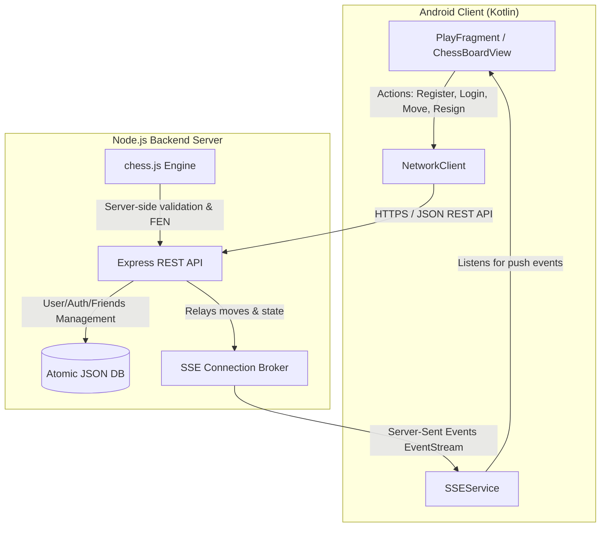

<p align="center">
  
  
</p>

<p align="center">
  
  
  
  
</p>

<p align="center">
  <strong>Chessomania</strong> is a state-of-the-art hybrid chess platform featuring a <strong>native Android client (Kotlin)</strong> paired with a <strong>real-time backend server (Node.js + Express + SSE)</strong>. Built from the ground up to offer premium aesthetics, lag-free gameplay, and highly-optimized local engines, it supports online multiplayer matchmaking, coordinate training, interactive puzzles, local minimax AI, and full post-game review analytics.
</p>

---

## 👨‍💻 Meet the Developer

<p align="left">
  <a href="https://www.linkedin.com/in/ai-himanshu-sharma"></a>
  <a href="mailto:himanshusharma.shriram@gmail.com"></a>
  <a href="https://github.com/Swelo-ui"></a>
</p>

<table align="center" style="border: none; border-collapse: collapse; width: 100%;">
  <tr style="border: none;">
    <td align="center" valign="middle" width="180" style="border: none; padding: 15px;">
      <a href="https://www.linkedin.com/in/ai-himanshu-sharma">
        
      </a>
    </td>
    <td valign="top" style="border: none; padding: 15px;">
      <h3 style="margin-top: 0; color: #007ACC; font-size: 1.5em; font-family: sans-serif;">Himanshu Sharma</h3>
      <p style="font-size: 1.1em; font-weight: bold; margin-bottom: 8px; color: #2c3e50;">Lead Software Engineer & Distributed Systems Architect</p>
      <p style="margin-top: 5px; color: #4b5563; line-height: 1.6; font-size: 0.95em;">
        Full-stack engineer passionate about crafting low-latency, real-time applications and robust mobile experiences. Creator of Chessomania, designing the custom graphics pipeline for the chess engine client, and building the server's SSE message broker.
      </p>
      <p style="margin-top: 15px; font-size: 0.95em;">
        <a href="https://www.linkedin.com/in/ai-himanshu-sharma" style="text-decoration: none; font-weight: bold; color: #0077B5;">🔗 Connect on LinkedIn</a>
        &nbsp;&nbsp;•&nbsp;&nbsp;
        <a href="mailto:himanshusharma.shriram@gmail.com" style="text-decoration: none; font-weight: bold; color: #D14836;">✉️ Send an Email</a>
        &nbsp;&nbsp;•&nbsp;&nbsp;
        <a href="https://github.com/Swelo-ui" style="text-decoration: none; font-weight: bold; color: #24292e;">💻 Follow on GitHub</a>
      </p>
    </td>
  </tr>
</table>

---

## 🚀 Quick Download & Web Links

*   **Download Android APK**: Get the latest compiled build instantly:
    *   **Local Host Port**: `http://localhost:3000/chessomania.apk` (Download from local server instance)
    *   **Vercel CDN Link**: `https://chessomania-server.vercel.app/chessomania.apk` *(or your custom vercel deployment URL)*
*   **Web App Client**: Play directly from your browser:
    *   **Local Server**: [http://localhost:3000](http://localhost:3000) or `/chess`
    *   **Vercel Client**: `https://chessomania-server.vercel.app/`

---

## 📱 Visual Interface Preview

Below is a design and feature preview of the Chessomania application:

<p align="center">
  
</p>

---

## 🌟 Core Features Showcase

<table width="100%">
  <tr>
    <td width="50%" valign="top">
      <h4>⚡ Real-time Multiplayer</h4>
      <p>Seamless online play with friends using Server-Sent Events (SSE). Features user presence (Online/Offline/In-Game), challenge notifications, real-time board sync, and automated board perspective flipping for Black.</p>
    </td>
    <td width="50%" valign="top">
      <h4>🤖 Local Heuristic Engine</h4>
      <p>Play offline against ChessAI using Minimax search with Alpha-Beta pruning. Optimized search heuristics allow 4 selectable difficulty levels (Easy, Medium, Hard, Max) running at sub-50ms turn times.</p>
    </td>
  </tr>
  <tr>
    <td width="50%" valign="top">
      <h4>🧩 Offline Puzzle Trainer</h4>
      <p>Solve hundreds of preloaded tactical chess scenarios. Features interactive UI validation, move evaluations, streak counters, and automated board resets on failure.</p>
    </td>
    <td width="50%" valign="top">
      <h4>🎯 Coordinates Recognition</h4>
      <p>Improve chess board sight and notation speed. An interactive mini-game prompts coordinate square targets on a timer to train your muscle memory.</p>
    </td>
  </tr>
  <tr>
    <td width="50%" valign="top">
      <h4>🎨 Board & Piece Customization</h4>
      <p>Personalize your environment with 10 board color palettes, 24 unique vector-based chess piece styles (from classic to neo-modern), and 9 responsive audio themes.</p>
    </td>
    <td width="50%" valign="top">
      <h4>🛡️ Crash Guard & Diagnostics</h4>
      <p>Integrates a global uncaught exception boundary redirecting crashes to a dedicated `CrashActivity` screen showing raw log traces to easily debug build or execution issues.</p>
    </td>
  </tr>
</table>

---

## 📐 System Architecture

Chessomania runs on a decoupled client-server model, utilizing lightweight REST APIs for session management and **SSE (Server-Sent Events)** for low-overhead real-time multiplayer updates.



### Backend Architecture Highlights
*   **Persistent Event Broker**: Employs an SSE-based client broker that maintains online status states. An offline queue tracks the last 50 events for each offline friend, ensuring message delivery during network transitions.
*   **Atomic Database Operations**: Uses atomic, non-blocking disk operations writing to JSON (`data/*.json`). Employs a staging-write-and-swap strategy (`renameSync`) preventing corruption during simultaneous server writes.
*   **Server-Side Verification**: Active game states are represented as FEN configurations validated by `chess.js` server-side, preventing client-side hacks.
*   **Zero-Auth Quick Rooms**: Code-based matchmaking system (`/api/room/*`) generates unique 6-character room codes. Pairs hosts and guests over temporary memory maps with zero session overhead.

### Mobile App Subsystem Highlights
*   **Custom Graphics Engine**: Built custom `ChessBoardView` using Android Canvas APIs. Provides hardware-accelerated piece rendering, touch-gesture translations, and coordinate overlays.
*   **SSEService & Reconnection**: Operates an Android Foreground/Background-safe SSE connection using OKHttp EventSource. Incorporates exponential backoff logic (1s → 2s → 4s ... up to 30s) to survive signal drops.
*   **Token Security**: Uses SharedPreferences encrypted with Android Keystore (`SecurePrefs`) to securely hold JWT tokens for seamless auto-logins.

---

## 📂 Project Repository Map

Below is the directory map of the codebase with relative source links:

```text
chessomania/
├── ChessomaniaApp/                         # Native Android Application (Kotlin)
│   ├── app/
│   │   ├── src/
│   │   │   ├── main/
│   │   │   │   ├── AndroidManifest.xml     # App permissions, Activities, & SSE Service declarations
│   │   │   │   ├── assets/                 # App icons, splash assets, and fonts
│   │   │   │   ├── java/com/chessomania/app/
│   │   │   │   │   ├── ChessApp.kt         # Global Application context and initialization
│   │   │   │   │   ├── CrashActivity.kt    # Custom diagnostic crash-catcher screen
│   │   │   │   │   ├── MainActivity.kt     # App entry point, routing to fragments
│   │   │   │   │   ├── SettingsManager.kt  # Auto-detects server URLs and network properties
│   │   │   │   │   ├── SplashActivity.kt   # Smooth branded launch screen
│   │   │   │   │   ├── chess/
│   │   │   │   │   │   ├── ChessAI.kt      # Offline opponent minimax heuristic engine
│   │   │   │   │   │   ├── ChessGame.kt    # Board-state helper, coordinates mapper
│   │   │   │   │   │   └── PuzzleDatabase.kt# Local database for offline chess puzzles
│   │   │   │   │   ├── net/
│   │   │   │   │   │   ├── NetworkClient.kt# REST client for user registration, auth, & matchmaking
│   │   │   │   │   │   ├── SSEService.kt   # Establishes EventStream connection for push events
│   │   │   │   │   │   ├── SecurePrefs.kt  # Securely encrypts JWT tokens in local memory
│   │   │   │   │   │   └── SseEvent.kt     # Event models mapping server notifications
│   │   │   │   │   └── ui/
│   │   │   │   │       ├── ChessBoardView.kt# Custom board component rendering pieces & handle inputs
│   │   │   │   │       ├── CoordinatesFragment.kt # Trainer for notation recognition skills
│   │   │   │   │       ├── GameReviewActivity.kt  # Post-game walkthrough and analysis tool
│   │   │   │   │       ├── PlayFragment.kt  # Lobby UI, Friend matchmaking, AI config
│   │   │   │   │       ├── PuzzleFragment.kt# Puzzle dashboard with streaks and validation
│   │   │   │   │       └── SettingsFragment.kt# Board themes, piece styles, and network details
│   │   │   │   └── res/                     # XML layouts, drawable piece vectors, colors, themes
│   │   │   └── test/
│   │   └── build.gradle.kts                 # App module gradle build script
│   └── settings.gradle.kts                  # Gradle project configs
├── data/                                    # Server local JSON storage
│   ├── users.json                           # Credentials storage (Hashed passwords)
│   ├── friends.json                         # Friend lists and status mapping
│   └── games.json                           # Active and pending game logs
├── public/                                  # Static Web Assets (Frontend Client)
│   ├── chess/
│   │   └── index.html                       # Web Client interface
│   ├── logo/                                # Complete logo set and branding files
│   └── chessomania.apk                      # Compiled Android APK binary (Static serving)
├── server.js                                # Core Express REST & SSE Real-time server
├── package.json                             # Server dependencies config
├── vercel.json                              # Vercel Serverless hosting deployment configurations
├── check_build_ready.bat                    # Script to verify local Gradle, Java, and source files
└── build_app.bat                            # Script to compile debug APK using gradlew
```

### 🔗 Quick File Shortcuts
*   **Android Interface Logic**: [PlayFragment.kt](file:///h:/chessomania/ChessomaniaApp/app/src/main/java/com/chessomania/app/ui/PlayFragment.kt) | [ChessBoardView.kt](file:///h:/chessomania/ChessomaniaApp/app/src/main/java/com/chessomania/app/ui/ChessBoardView.kt) | [GameReviewActivity.kt](file:///h:/chessomania/ChessomaniaApp/app/src/main/java/com/chessomania/app/ui/GameReviewActivity.kt)
*   **Mobile Core & Network**: [MainActivity.kt](file:///h:/chessomania/ChessomaniaApp/app/src/main/java/com/chessomania/app/MainActivity.kt) | [SettingsManager.kt](file:///h:/chessomania/ChessomaniaApp/app/src/main/java/com/chessomania/app/SettingsManager.kt) | [SSEService.kt](file:///h:/chessomania/ChessomaniaApp/app/src/main/java/com/chessomania/app/net/SSEService.kt)
*   **Backend Server**: [server.js](file:///h:/chessomania/server.js) | [vercel.json](file:///h:/chessomania/vercel.json)

---

## ⚡ Multiplayer SSE Protocol Specification

The real-time streaming endpoint `/api/events` pushes JSON events. Here are the core specifications:

### 1. Handshake Established
```json
{ "type": "connected", "username": "player1" }
```
### 2. Presence Update
```json
{ "type": "friend_status", "username": "player2", "status": "online" } // online | offline | in_game
```
### 3. Incoming Challenge
```json
{ "type": "challenge_incoming", "challengeId": "uuid-v4-string", "from": "challenger1", "color": "white" }
```
### 4. Game Start
```json
{ "type": "game_start", "gameId": "uuid-v4-string", "white": "player1", "black": "player2" }
```
### 5. Move Sync
```json
{
  "type": "game_move",
  "gameId": "uuid-v4-string",
  "from": "e2",
  "to": "e4",
  "promotion": null,
  "fen": "rnbqkbnr/pppppppp/8/8/4P3/8/PPPP1PPP/RNBQKBNR b KQkq e3 0 1",
  "san": "e4",
  "status": "active",
  "winner": null
}
```
### 6. Game Over (Draw, Resignation, or Checkmate)
```json
{ "type": "game_ended", "gameId": "uuid-v4-string", "status": "resigned", "winner": "player1", "loser": "player2" }
```

---

## 🔌 API Endpoint Reference

| Method | Endpoint | Auth | Description |
| :--- | :--- | :--- | :--- |
| **POST** | `/api/register` | No | Creates a user account with case-insensitive checking. |
| **POST** | `/api/login` | No | Authenticates user, issues 7-day JWT token. |
| **GET** | `/api/events` | Yes | Establishes permanent SSE connection. |
| **GET** | `/api/friends/list`| Yes | Lists all friends and their live status. |
| **POST** | `/api/friends/request`| Yes | Sends a friend invitation. |
| **POST** | `/api/challenge/send`| Yes | Sends game challenge to an online friend. |
| **POST** | `/api/game/move` | Yes | Relays, validates move against rules. |
| **POST** | `/api/room/create` | No | Instantiates quick room (6-char pairing code). |
| **GET** | `/api/room/events/:code`| No | Connects to quick room SSE lobby. |

---

## 🛠️ Build & Installation Guide

Follow these steps to build the application from source:

### Environment Configuration
*   **Java Development Kit (JDK)**: Version 17 is required.
*   **Node.js**: v18 or later is recommended.
*   **Android SDK**: Android command-line tools installed.

### 1. Launch Backend Server
```bash
# Clone the repository
git clone https://github.com/Swelo-ui/Chessomania.git
cd chessomania

# Install dependencies
npm install

# Run backend
node server.js
```
The server now listens on `http://localhost:3000`. Access `http://localhost:3000` to load the browser interface.

### 2. Compile Android Client
We've automated pre-build checking and compilation:

1.  **Check build readiness**:
    ```bash
    check_build_ready.bat
    ```
    This verifies Java versions, SDK directory structures, Gradle properties, and file availability.
2.  **Compile & Package**:
    ```bash
    build_app.bat
    ```
    This executes `gradlew clean assembleDebug` and produces the package.

*If compiling manually*:
```bash
cd ChessomaniaApp
./gradlew clean assembleDebug --stacktrace
```
The resulting package will be outputted to:
`ChessomaniaApp/app/build/outputs/apk/debug/app-debug.apk`

### 3. Deploy to Device (ADB)
Ensure Developer Options and USB Debugging are active, connect your device via USB, and run:
```bash
adb install ChessomaniaApp\app\build\outputs\apk\debug\app-debug.apk
```

---

## 🛑 Troubleshooting & Connectivity

### 1. Emulator loopback connection
*   The application automatically detects when it is active on an Android emulator.
*   Maps all network configurations dynamically to `http://10.0.2.2:3000` to target the host PC's backend server.

### 2. Physical Device Networking
*   Verify your computer running the Node.js backend and the target Android phone are on the **same Wi-Fi channel**.
*   The application auto-detects local host interfaces and displays them in the UI.
*   **Long-press** the displayed server info string in the lobby to copy the URL configuration.
*   If your system blocks incoming connections on port 3000, add a Firewall rule on the host PC:
    ```bash
    netsh advfirewall firewall add rule name="ChessNode3000" dir=in action=allow protocol=TCP localport=3000
    ```

---

## 🛡️ License & Security

*   **Security Policies**: Review [SECURITY.md](file:///h:/chessomania/SECURITY.md) for vulnerability reports and response procedures.
*   **Contributions**: Pull requests are welcome. Feel free to open issues or submit features.

---
<p align="center">Made with ❤️ for chess lovers. Play hard, checkmate fast! ♟️</p>
